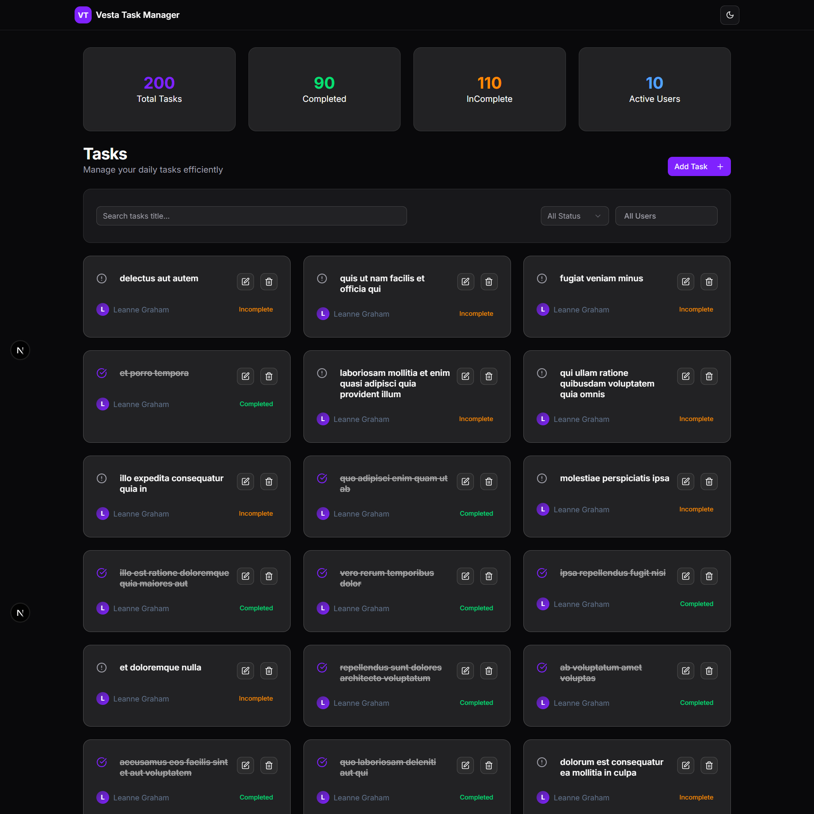

# 📝 Todo App

A modern, clean, and efficient task management dashboard built with React, Next.js, TypeScript, and SWR.  
Organize and track your daily tasks, assign them to users, and boost your productivity!

---



---

## 🚀 Getting Started

Clone the repository and install dependencies:

```bash
npm install
```

Start the development server:

```bash
npm run dev
```

Open [http://localhost:3000](http://localhost:3000) in your browser to see the app.

---

## 📁 Project Folder Structure

```
todo-app/
│
├── public/
│
├── src/
│   ├── app/                       # Next.js app directory
│   │   ├── favicon.ico
│   │   ├── globals.css
│   │   ├── layout.tsx             # Root layout
│   │   ├── page.tsx               # Main dashboard page
│   │   └── [id]/                  # Dynamic route for task details
│   │       └── page.tsx
│   │
│   ├── components/                # Reusable React components
│   │   ├── TodoContent.tsx        # Main content (fetches users, todos, handles filter)
│   │   ├── TodoFilter.tsx         # Filtering tasks by status/user
│   │   ├── TodoForm.tsx           # Add new task
│   │   ├── TodoList.tsx           # List and manage tasks
│   │   └── ui/                    # UI primitives
│   │       ├── dialog.tsx
│   │       ├── dropdown-menu.tsx
│   │       └── select.tsx
│   │
│   ├── lib/                       # types, and context
│   │   ├── fetchData.ts           # API fetch helpers
│   │   ├── TodoContext.tsx        # Global todo state/context
│   │   ├── types.ts               # TypeScript types
│   │   └── utils.ts               # Utility functions
│   │
│   └── ...
│
├── .gitignore
├── package.json
├── README.md
└── ...
```

---

## ✨ Features

- Add, edit, and delete tasks
- Assign tasks to users
- Filter tasks by status and user
- View task details with dynamic routing
- Responsive and modern UI
- State management with React Context + SWR

---

## 🛠️ Tech Stack

- [React](https://react.dev/)
- [Next.js](https://nextjs.org/)
- [TypeScript](https://www.typescriptlang.org/)
- [SWR](https://swr.vercel.app/)
- [Shadcn UI](https://ui.shadcn.com/)
- [Tailwind CSS](https://tailwindcss.com/)
- [Framer Motion](https://motion.dev/)
- [Lucide Icons](https://lucide.dev/)

---

## 📌 Notes

- Tasks added locally (not from API) will only persist until page refresh, unless you implement a backend .
- The app uses [JSONPlaceholder](https://jsonplaceholder.typicode.com/) for demo API data.

---

## 🤝 Contributing

Pull requests are welcome! For major changes, please open an issue first to discuss what you would like to change.
